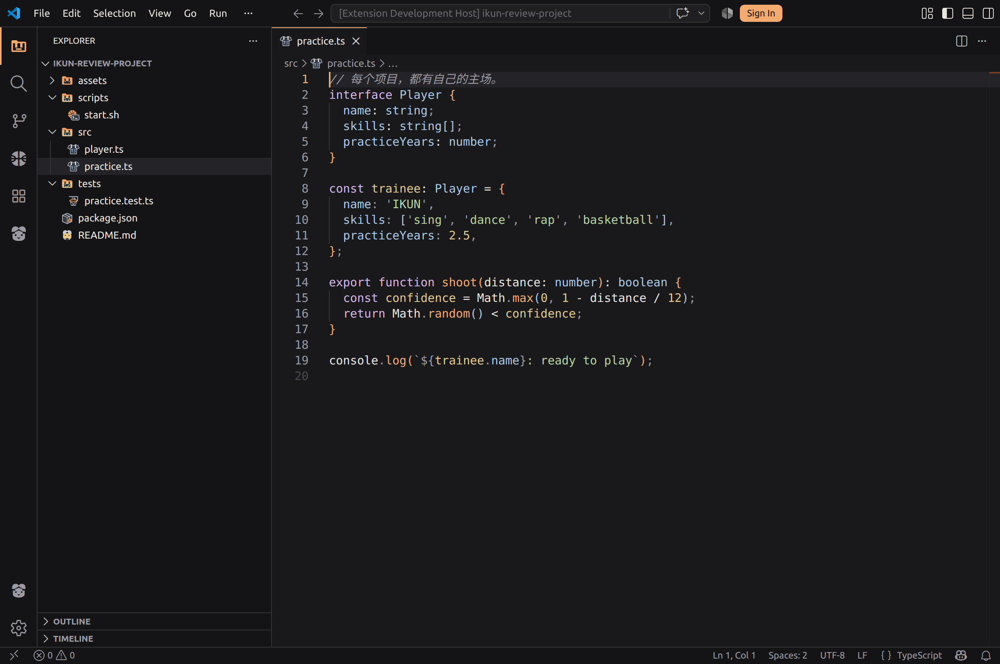
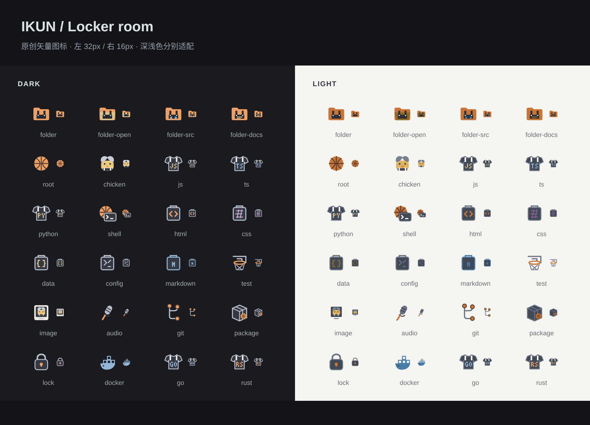
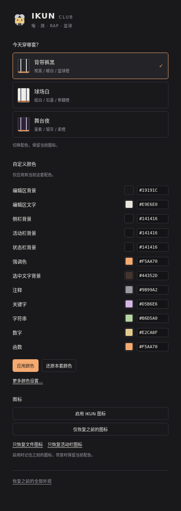

# IKUN Club · 背带裤与篮球

**把梗画进图标，把空间留给代码。**

一套完全离线的 VS Code 主题。中分小鸡、背带裤文件夹、语言球衣、篮球终端——使用统一的矢量轮廓和低饱和配色，不铺壁纸、不弹窗、不自动播放。



## 图标有梗，也有用

- 文件夹采用暖橙色轮廓与深色背带；展开时前盖打开。源码、文档、测试目录各有不同标记。
- JS / TS / Python / Go / Rust 等代码文件是语言球衣，字母由矢量路径绘制，不依赖字体。
- Shell 脚本是篮球和终端提示符。支持 sh、bash、zsh、fish、ps1、bat、cmd 及常见 shell 配置文件。
- 配置是战术板，测试文件是篮筐，图片是中分小鸡拍立得，音频是麦克风。
- README、AGENTS.md、CLAUDE.md 使用中分小鸡；锁文件、包文件、Git 和数据库保留明确用途标识。
- 活动栏资源管理器是背带文件夹，运行调试是篮球，账号是中分小鸡。



共 48 种图标造型，分别输出深色和浅色版本；覆盖 75 个文件后缀规则。测试篮筐是文件类型图标，不代表测试执行状态。

## 三套外观

| 配色 | 视觉 |
| --- | --- |
| 背带裤黑 | 炭黑、暖白、篮球橙 |
| 球场白 | 纸白、石墨、焦糖橙 |
| 舞台夜 | 墨紫、银灰、柔橙 |

## 安装与切换

在扩展视图菜单选择 **从 VSIX 安装**，安装 `ikun-vscode-theme-0.3.0.vsix`。

命令面板执行 **IKUN: 启用日常套装**，或 **IKUN: 打开主题衣柜** 选择配色。原来的 `ikun.openClub` 命令 ID 保持兼容。



衣柜中的三套配色按钮只切换配色，保留当前图标；命令面板的“启用日常套装 / 启用整活套装”仍会一次应用配色和两类图标。

### 自定义颜色

衣柜提供 12 项取色器和 HEX 输入：编辑区背景与文字、侧栏、活动栏、状态栏、强调色、选区，以及注释、关键字、字符串、数字、函数。只保存修改过的项，每套 IKUN 配色分别保存；语法颜色同时适配 TextMate 与语义高亮。“更多颜色设置”打开 VS Code 原生颜色设置。

“还原本套颜色”恢复本扩展修改前的颜色覆盖；保留无关设置及后来手动改过的值。颜色设置使用 [VS Code 原生主题覆盖机制](https://code.visualstudio.com/docs/configure/themes#_customizing-a-color-theme)，不写入扩展安装目录。工作区和语言专属覆盖仍可能优先于用户设置。

### 单独恢复图标

- **IKUN: 仅恢复之前的图标**：恢复文件和活动栏图标，保留配色。
- **IKUN: 只恢复文件图标** / **IKUN: 只恢复活动栏图标**：分别恢复。
- **IKUN: 启用 IKUN 图标**：只应用图标，并记住应用前的选择。
- **IKUN: 恢复之前的外观**：恢复三类外观设置及本扩展保存的颜色覆盖。

恢复依据首次应用对应设置时保存的全局值，不覆盖后来手动选择的其他主题；此前没有通过本扩展启用的图标没有可恢复的快照。

仅改颜色可用 VS Code 自带的“首选项: 颜色主题”；文件和产品图标也可分别选择。更新安装后执行 **Developer: Reload Window**。

没有云服务、账号、遥测、素材导入、背景注入和合成音效。不会修改 VS Code 安装文件。

## 开发和验证

```sh
npm ci
npm run build
npm run check
npm test
npm run test:visual
npm run package
```

视觉检查需要 Chromium：`npx playwright install chromium`，或用 `IKUN_CHROME` 指定浏览器路径。按 F5 启动扩展开发窗口。`test/host.cjs` 可通过 VS Code 的 `--extensionTestsPath` 运行真实扩展宿主检查。

颜色源文件：`scripts/build.mjs`；原创图标：`scripts/build-icons.mjs`。产品图标字体已经提交，普通构建不需要 Python。修改 `assets/product/*.svg` 后，可用 `fonttools` + `brotli` 执行 `python3 scripts/build-product-font.py` 重新生成。

素材参考见 [资源调研](docs/RESOURCES.md) 和 [第三方声明](THIRD_PARTY_NOTICES.md)。非官方粉丝作品。
