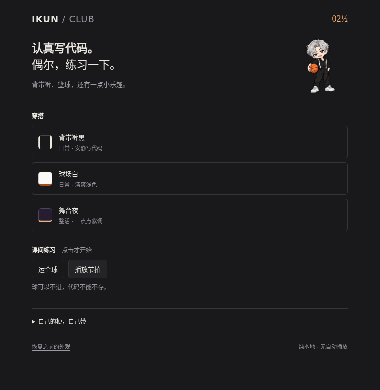

# IKUN Club · 背带裤与篮球

一个克制的 iKun 风格 VS Code 主题包。纯色编辑区、黑白背带裤、篮球橙，以及练习室里一张小小的动漫贴纸。完全本地运行，无账号、遥测或云服务。

## 包含什么

- **背带裤黑**：炭黑、暖白、低饱和篮球橙。
- **球场白**：浅色球场配色，保留清楚的语法层次。
- **舞台夜**：略带紫调的深色模式，同样没有大片背景。
- 文件图标：常见语言可辨认，项目根目录是篮球，源码目录是衣服。
- 界面图标：基于 Phosphor 的线性图标，少量篮球和衣服彩蛋。
- 练习室：小动漫贴纸、点击动效、本地合成节拍，以及图片 / GIF / 音频导入。



## 安装

下载或本地构建 `ikun-vscode-theme-0.1.0.vsix`，在 VS Code 的扩展菜单中选择 **从 VSIX 安装**。

命令面板执行 **IKUN: 启用日常套装** 或 **IKUN: 启用整活套装**；也可以执行 **IKUN: 打开练习室** 选择三种配色。仅切换颜色可使用 VS Code 的“首选项: 颜色主题”。

套装会更新当前用户 Profile 的颜色、文件图标和产品图标，首次启用前保存原全局值。**IKUN: 恢复之前的外观** 恢复仍属于 IKUN 的设置，不覆盖后来手动选择的其他主题。工作区覆盖设置仍优先，必要时在工作区设置中清除覆盖。

没有开机弹窗、自动播放、编辑区背景注入或修改 VS Code 安装文件。动画遵循系统减少动态效果设置；隐藏练习室会停止声音。内置节拍是合成鼓点，不是歌曲或真人语音。

## 本地素材

练习室可以导入不超过 20 MB 的 PNG/JPG/WebP/GIF 或 MP3/WAV/OGG，复制到扩展本地存储。选择“恢复默认素材”即可取消使用。推荐使用动漫 / 梗图。媒体解码能力依赖 VS Code 的 Electron，MP3/WAV 通常更兼容。

## 开发

```sh
npm ci
npm run build
npm run check
npm test
npm run package
```

按 F5 启动独立扩展开发窗口。运行时没有 npm 依赖。`scripts/build.mjs` 从 Phosphor 构建图标和三套主题。

素材来源与检索记录见 [资源调研](docs/RESOURCES.md) 和 [第三方声明](THIRD_PARTY_NOTICES.md)。此项目是非官方粉丝创作，不代表任何艺人或品牌。
